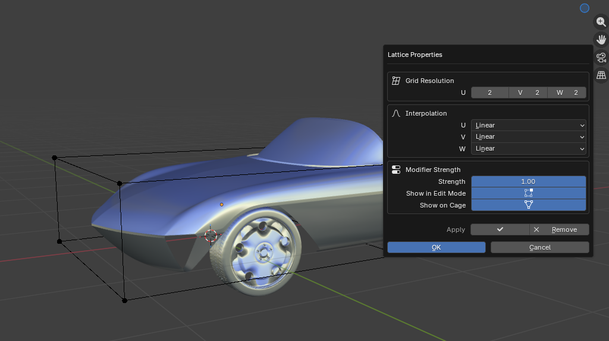

# Preferences

WeightLattice exposes addon preferences that define the default behavior of the workflow. They are available in **Edit > Preferences > Add-ons > WeightLattice**.

## Creation defaults

These values are used when a new lattice is generated:

- **Resolution U**: Default number of lattice points on the U axis.
- **Resolution V**: Default number of lattice points on the V axis.
- **Resolution W**: Default number of lattice points on the W axis.
- **Padding**: Extra space added around the weighted bounding box.
- **Strength**: Default modifier strength.
- **Interpolation**: Default interpolation mode.

## Modifier settings

These preferences affect how the lattice behaves in the stack:

- **Modifier Position**: Place the modifier at the top or bottom of the stack.
- **Show in Edit Mode**: Display the deformation while editing the mesh.
- **Show on Cage**: Match the edit cage to the modifier result.

## Workflow settings

These values affect cleanup and selection logic:

- **Auto-cleanup Vertex Groups**: Remove the group when the lattice is removed, if it is no longer used elsewhere.
- **Weight Threshold**: Minimum weight value included in the lattice bounding box.

## Per-lattice properties

The same values can be edited per-lattice from the **Properties** dialog in Edit Lattice (press **X** or use the panel button). This dialog is useful when one specific cage needs settings different from the addon defaults.

## Recommended defaults

If you are unsure, keep the default settings and only increase resolution when you need more control over the final deformation.
