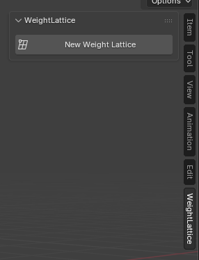
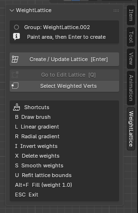
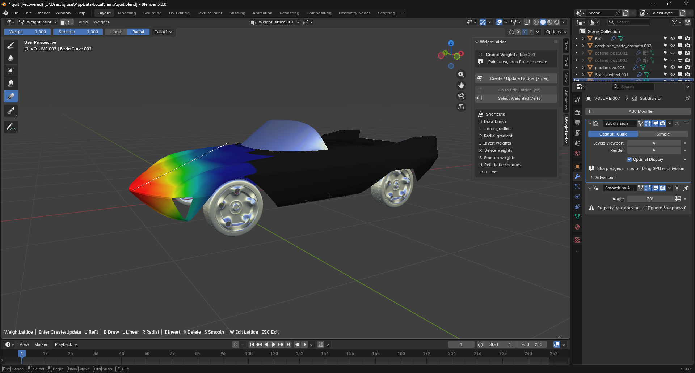
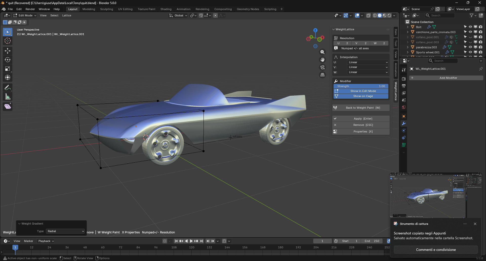
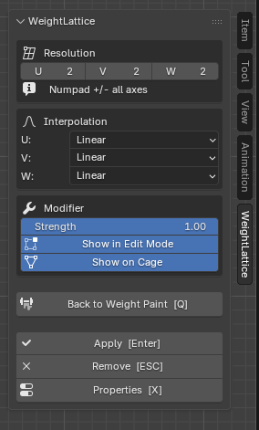
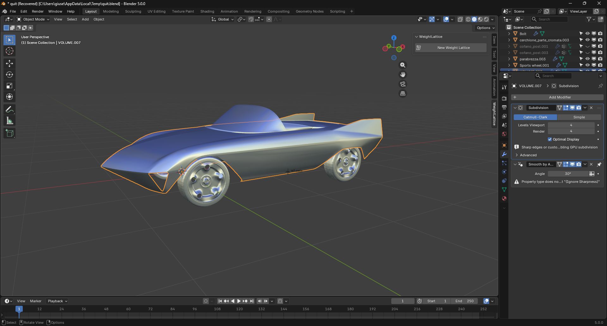

# Quick Start

This example shows the fastest way to use WeightLattice on a real modeling task.

## 1. Select the mesh

Start from the object you want to deform and open the **WeightLattice** panel in the 3D Viewport sidebar (N-panel).

## 2. Create a WeightLattice group

Use **New Weight Lattice** to create a new vertex group and jump into Weight Paint mode.

## 3. Paint the target area

Paint the part of the model that should be controlled by the lattice. In this example, the painted area defines the front section of the car body.

## 4. Create the lattice

Press **Enter** or click **Create / Update Lattice** to generate a lattice around the painted region. The viewport switches to Edit Lattice automatically.

## 5. Edit the cage

Reshape the cage to define the new form. The N-panel exposes resolution, interpolation, and modifier settings.

## 6. Apply the result

When the new shape is correct, press **Enter** or click **Apply** to transfer the deformation back to the mesh.

## Result

You can quickly prototype controlled shape variations without manually editing the full mesh topology. See [Workflow](workflow.md) for the full step-by-step guide and for refit and multi-mesh cases.
