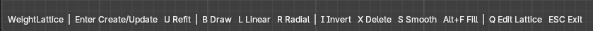
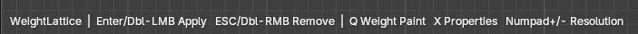
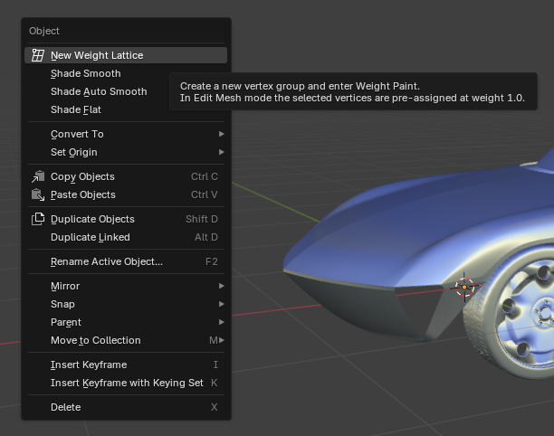
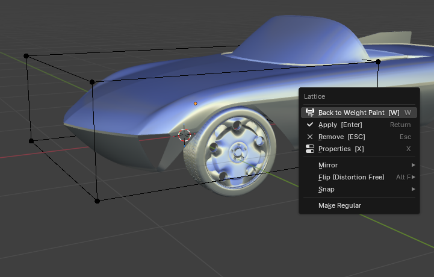

# Shortcuts

WeightLattice provides a compact set of shortcuts that drive the whole workflow without leaving the viewport.

## Weight Paint mode

- **Enter**: Create or update the lattice.
- **Double-click Left Mouse**: Create or update the lattice.
- **U**: Refit the lattice bounds to the current weights.
- **B**: Activate the Draw brush.
- **L**: Activate the Linear gradient.
- **R**: Activate the Radial gradient.
- **I**: Invert weights on the active vertex group.
- **X**: Delete weights on the active vertex group.
- **S**: Smooth weights on the active vertex group.
- **Alt+F**: Fill the active vertex group with weight 1.0 on every vertex.
- **Q**: Switch to Edit Lattice for the active group.
- **ESC**: Exit Weight Paint mode.

## Edit Lattice mode

- **Enter**: Apply the lattice on every mesh that uses it.
- **Double-click Left Mouse**: Apply the lattice.
- **ESC**: Remove the lattice without applying.
- **Double-click Right Mouse**: Remove the lattice.
- **Q**: Return to Weight Paint on the associated mesh.
- **X**: Open the Lattice Properties dialog.
- **Numpad +**: Increase lattice resolution on all axes.
- **Numpad -**: Decrease lattice resolution on all axes.

## Context menus

The right-click menu exposes the main entry points in every relevant mode.

## Notes

- The exact behavior of each shortcut depends on the active mode and on whether the current mesh already has a lattice linked to the active vertex group.
- `Q` replaces the old `W` binding used in earlier internal builds and avoids conflicts with common Blender defaults.
- `Alt+F` is used for Fill to avoid overlap with Blender's brush-size shortcut on plain `F`.
