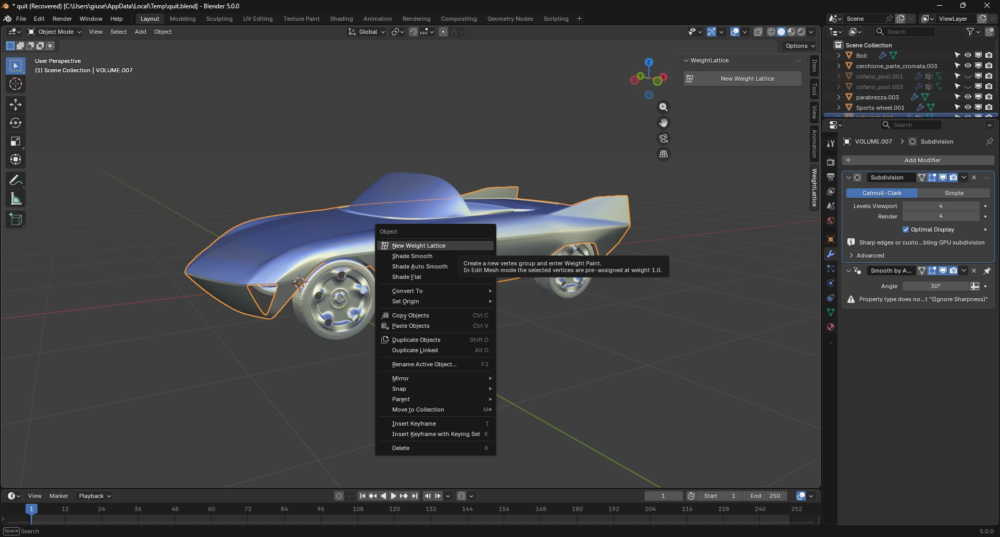
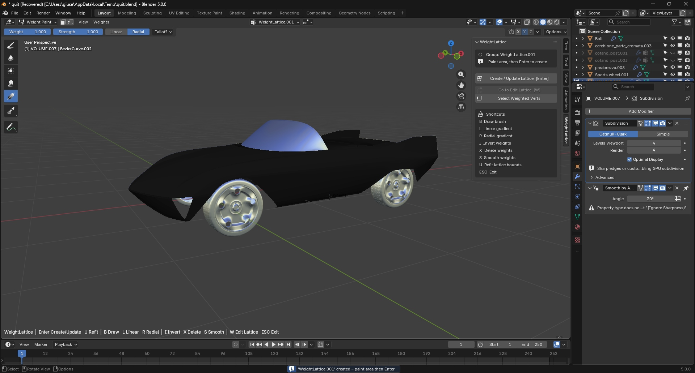
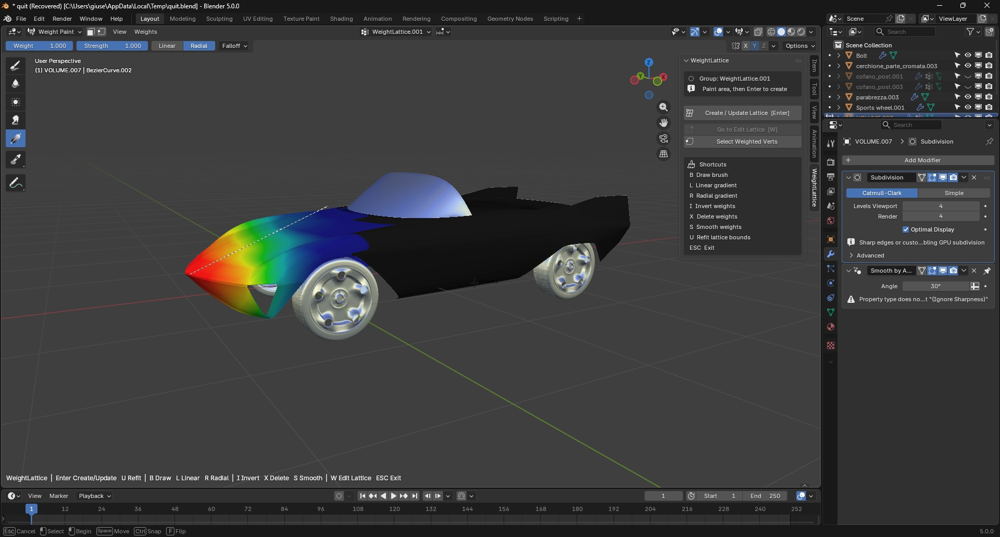
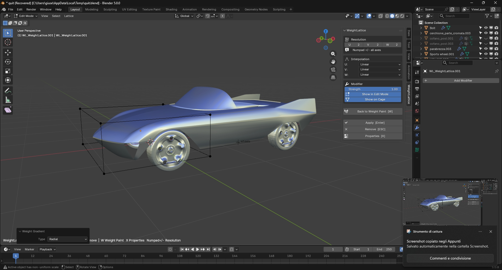
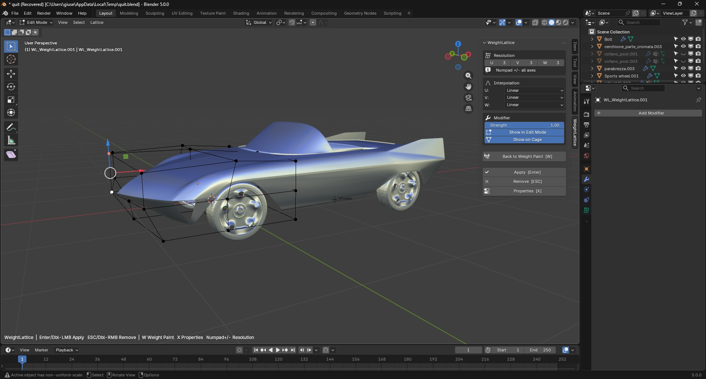
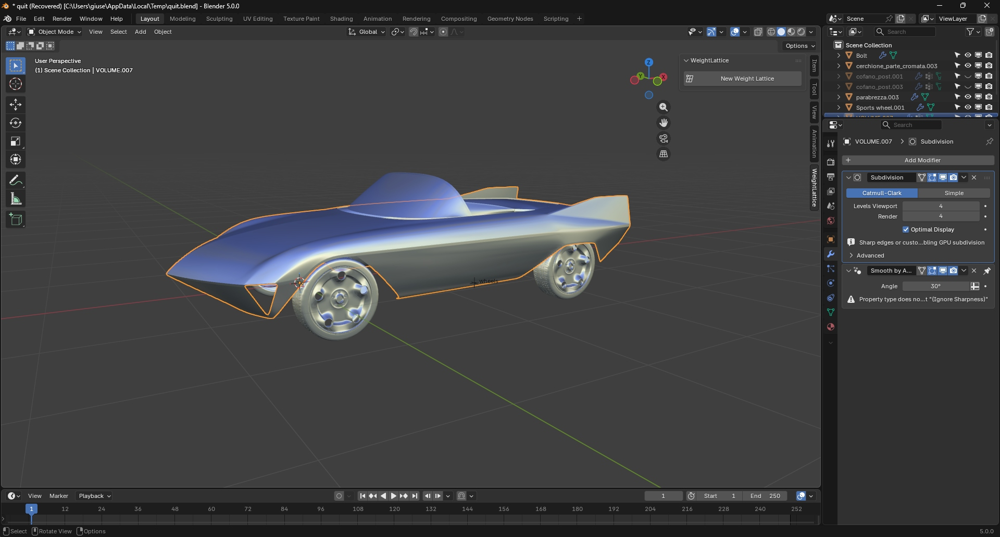

# Workflow

This example demonstrates a practical automotive use case: isolating the front section of a body and reshaping it with a generated lattice.

## Step 1 — Create a new WeightLattice group

Start in Object Mode with the target mesh selected. The WeightLattice panel provides the **New Weight Lattice** command, which creates a dedicated vertex group and starts the guided workflow.

## Step 2 — Enter Weight Paint mode

After the group is created, the addon switches to Weight Paint mode. At this point the active group is ready, and the panel shows the core actions and shortcuts used during the painting stage.

## Step 3 — Paint the deformation area

Paint the area that should be controlled by the lattice. In this example, the front section of the vehicle is isolated so the deformation stays local and easy to manage.

## Step 4 — Generate the lattice cage

Create the lattice from the painted region. The addon builds a deformation cage that fits the weighted area and switches the workflow toward lattice editing.

## Step 5 — Modify the lattice

Edit the lattice points to push and reshape the form. This is where the broad shape change happens, without directly editing the underlying mesh topology.

## Step 6 — Apply the new shape

Apply the lattice when the result is approved. The new form is transferred back to the mesh, making the shape change part of the object.

## Typical workflow in one line

Object Mode → New Weight Lattice → Weight Paint → Create Lattice → Edit Lattice → Apply
