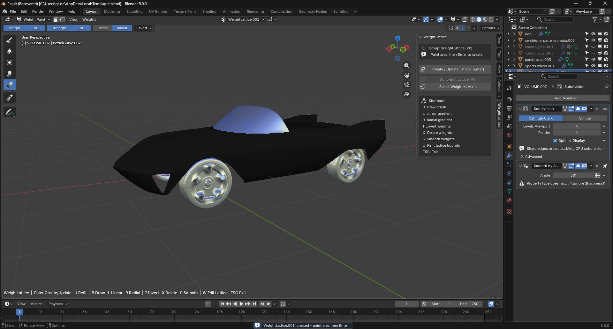
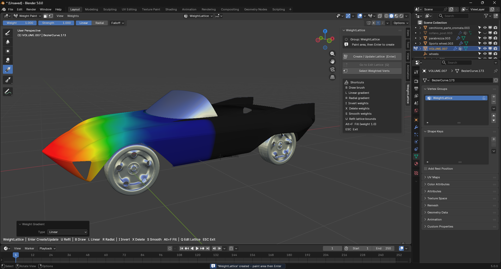
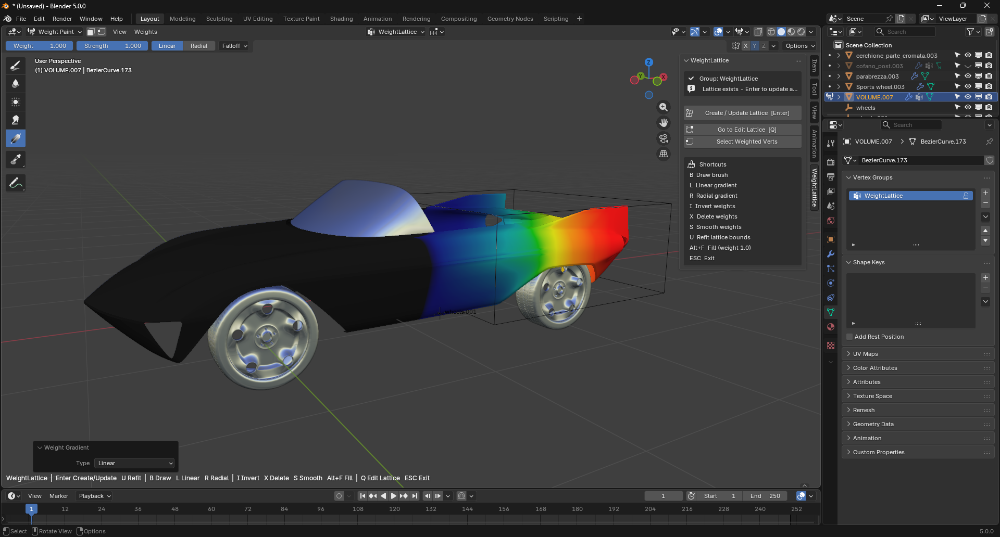
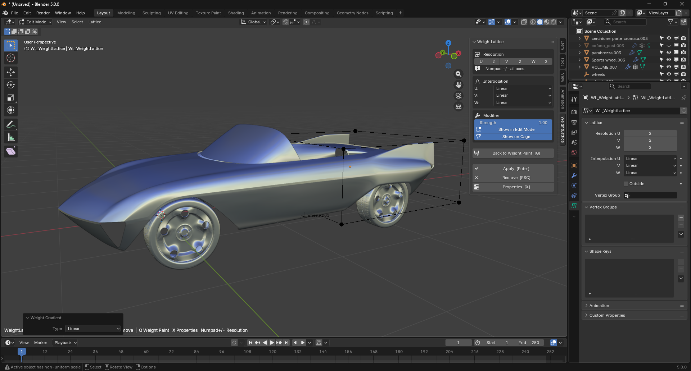

# Workflow

This example demonstrates a practical automotive use case: isolating the front section of a body and reshaping it with a generated lattice, then refining the result in a second pass.

## Create a new lattice

### Step 1 — New Weight Lattice

Start in Object Mode with the target mesh selected. The WeightLattice panel provides the **New Weight Lattice** command, which creates a dedicated vertex group and starts the guided workflow.

### Step 2 — Enter Weight Paint mode

After the group is created, the addon switches to Weight Paint mode. At this point the active group is ready, and the panel shows the core actions and shortcuts used during the painting stage.

### Step 3 — Paint the deformation area

Paint the area that should be controlled by the lattice. The painted region defines where the deformation will be applied. Use `Alt+F` to fill every vertex at 1.0 if you want the whole mesh to be affected.

### Step 4 — Generate the lattice cage

Press **Enter** (or click **Create / Update Lattice**) to generate the lattice. The cage fits the weighted area and the viewport switches to Edit Lattice so you can reshape it immediately.

### Step 5 — Modify the lattice

Edit the lattice points to push and reshape the form. This is where the broad shape change happens, without directly editing the underlying mesh topology.

### Step 6 — Apply the new shape

Apply the lattice when the result is approved. The new form is transferred back to the mesh, making the shape change part of the object.

## Update an existing lattice

It is common to refine the same area in more than one pass: paint more weight, adjust the cage, then apply again.

### Update step 1 — Re-enter Weight Paint

Go back into Weight Paint on the same vertex group that drives the lattice.

### Update step 2 — Apply and return

If a previous pass is still active, apply or remove the current lattice and re-enter the painting mode for the target group.

### Update step 3 — Extend the painted area

Paint additional vertices to grow the area that the new lattice should cover.

### Update step 4 — Refit the lattice

Press **U** to refit the lattice. The bounding box is recomputed to include the new weighted vertices and the control points are reset to their rest positions, so a previous deformation on the cage does not bleed into the new pass. Pressing **Enter** here would only re-open the existing cage without refitting — this is intentional, so you never lose a cage you have already shaped unless you ask for a refit explicitly.

### Update step 5 — Work on the refined cage

Continue shaping in Edit Lattice, then apply the final deformation.

## Multi-mesh workflows

WeightLattice also supports two shared-cage cases that skip the Weight Paint stage entirely:

- **Object Mode, multiple meshes selected**: `New Weight Lattice` builds a single cage that encloses every selected mesh. Each mesh receives a lattice modifier, no vertex group is created, and the view switches directly to Edit Lattice.
- **Edit Mesh, multiple meshes (multi-object edit)**: `Lattice from Selection` builds a shared cage around the selected vertices across all active meshes. Each mesh gets its own vertex group at weight 1.0 on those vertices.

### Shared Strength

When a cage is shared across multiple meshes, the **Strength** slider on the Edit Lattice panel is synchronised across every linked modifier. Moving the slider once updates all bound meshes in real time, so the group of meshes reacts as a single deformation system.

## Typical workflow in one line

Object Mode → New Weight Lattice → Weight Paint → Create Lattice → Edit Lattice → Apply
