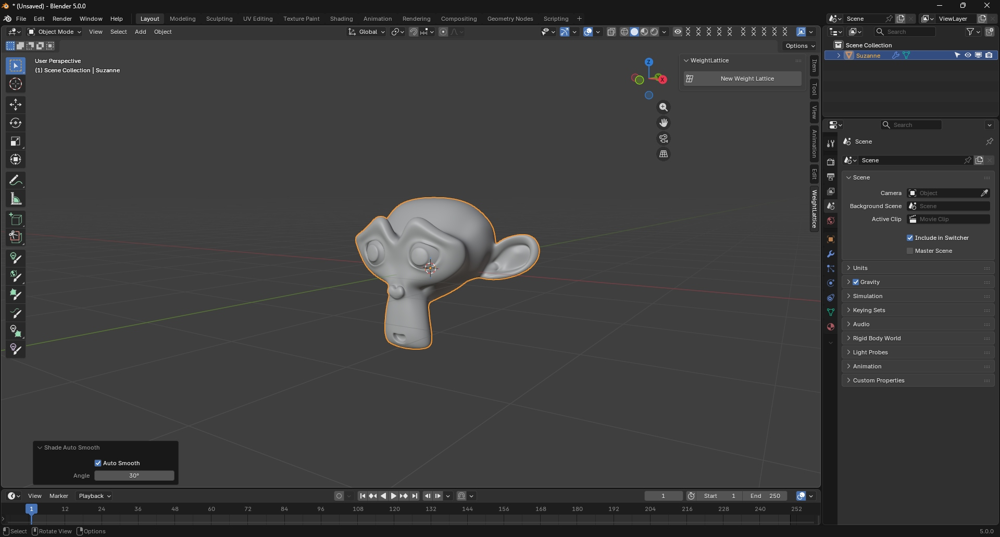
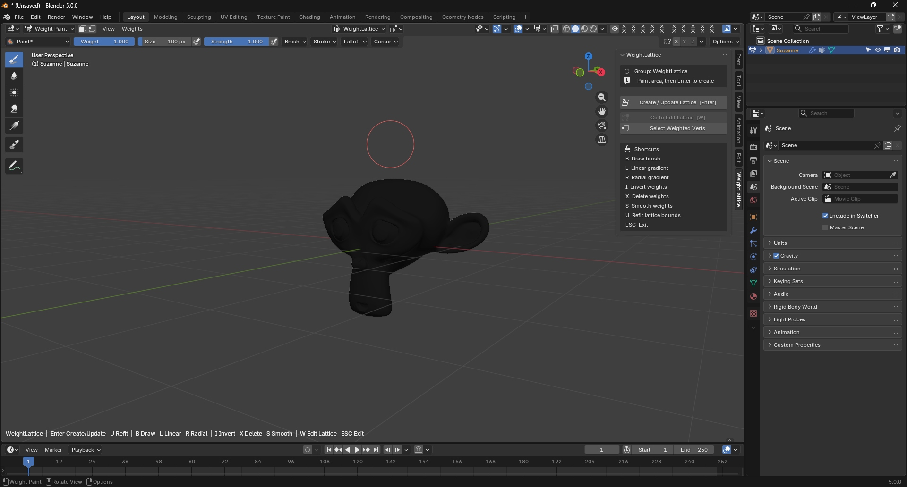
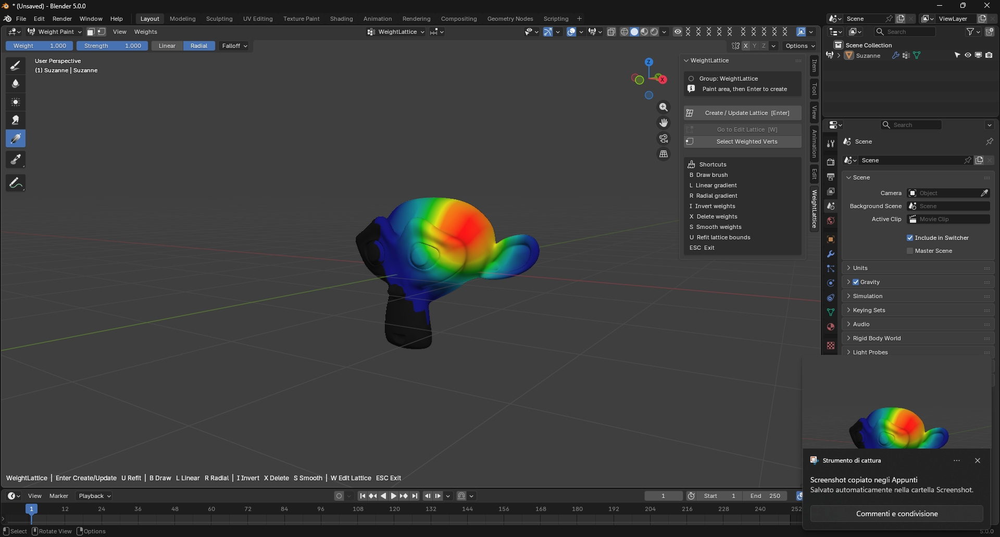
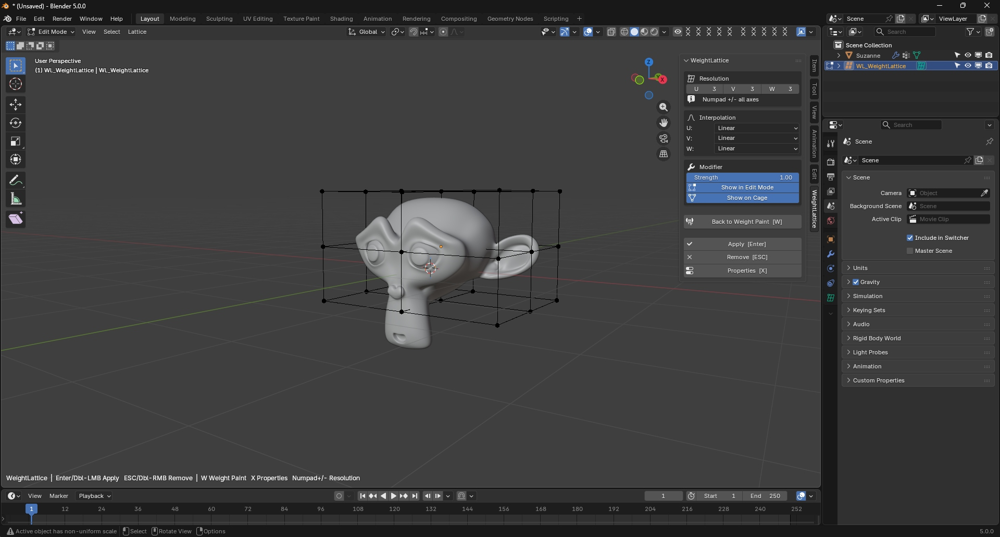
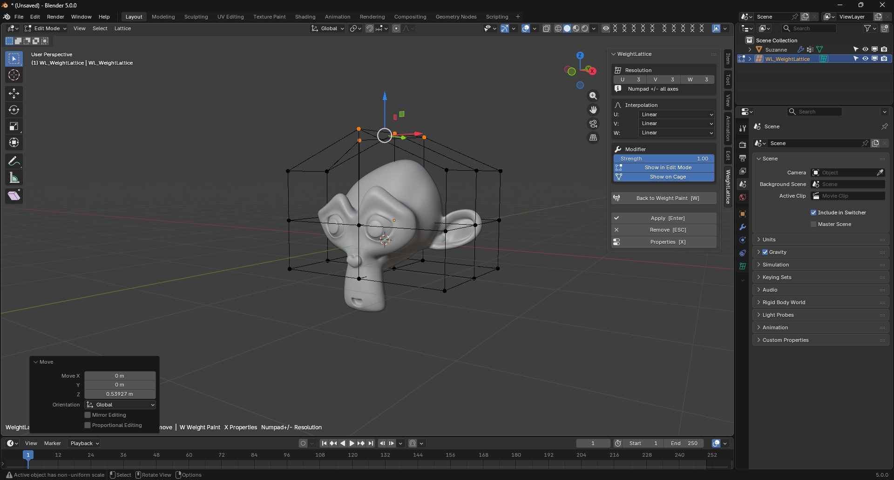

# Workflow

WeightLattice is built around a practical sequence that moves from painting to lattice editing with minimal friction.

## Step 1 — Start from the object

Begin with the mesh in the scene and the WeightLattice panel available in the sidebar.

## Step 2 — Paint the influence

Paint the vertex group that will drive the deformation region.

## Step 3 — Create the lattice

Use the creation command to build the lattice from the active painted group.

## Step 4 — Inspect the setup

Check the generated cage and verify that the deformation bounds are correct.

## Step 5 — Edit the lattice

Switch into Edit Lattice mode to refine the cage shape with precision.

## Step 6 — Return and finalize

When the lattice is ready, return to the mesh workflow or apply the deformation when finished.

## Typical workflow in one line

Mesh → Vertex Group → Weight Paint → Create Lattice → Edit Lattice → Apply or Remove
